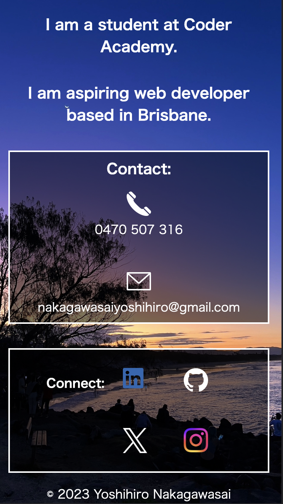
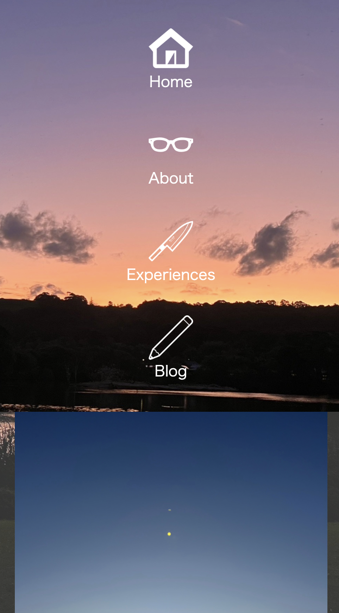

# T1A2 Portfolio Assignment

### Author: Yoshihiro Nakagawasai
[Website](https://website-portfolio-lovat.vercel.app/)

[Github Repository](https://github.com/YoshihiroNak/website-portfolio)

[Presentation](ppt/YoshihiroNakagawasai_T1A2_slide-deck.pdf)

##Purpose
The purpose of this site is the effective way to show my skills for potential employers to know how I develop a website. 
And Providing the way to connect me  in my portfolio has potential to get a job in the furture.
Furthermore, understanding my current technical abilty is helpful for me to know what I should do next.

##Functionality and Features
This website is optimazed for mobile, tablet and desktop views. So the layout optimizes depending on the viewing device.
My html basicaly has header, nav, main and footer.
And semantic tags are uesd in wide variety of ways. It helps for optimization of structure.
In my html, navigation bar is in header. Located at the above of the page, it makes easier to access other pages.
The subject of the page is in the main tags. And footer contains copyright statement. 

When hovering the mouse over a link, the button slowly turns orange.
Links contain *noopener noreferrer* so make it safer.
###Pages

#### Home
The home page has a navigation of the top of page thet allows you to access other pages and also, links to professional acconuts are down below main contact.

### About
The about page contains my personal details such as background.
The layouts are diffrent between mobile and tablet, desktop. Using flex for layouts lead to be easy to browse on any device.

### Experiences
The experiences page shows my education and work history.
This page alse has my resume. To click my resume button allows you to my resume PDF page.

### Blog
Thia blog page povides images of landscape in Byron Bay and Gold Coast.
Image itself has feature of button. So click the image and access the post page.

## Sitemap

## Screenshots

### Home page:

#### Desktop:

#### Tablet:

#### Mobile:

### About page:

#### Desktop:

#### Tablet:

#### Mobile:

### Experiences page:

#### Desktop:

#### Tablet:

#### Mobile:

### Blog page:

#### Desktop:

#### Tablet:

#### Mobile:

### Blog page:

#### Desktop:

#### Mobile:

# Target Audience

+ Prosective Employers
+ Web Developers

# Tech stack
+ Website: HTML and CSS
+ WWireframe and Sitemap: Figma
+ Resume: Google docs
+ Deploy: Vercel

